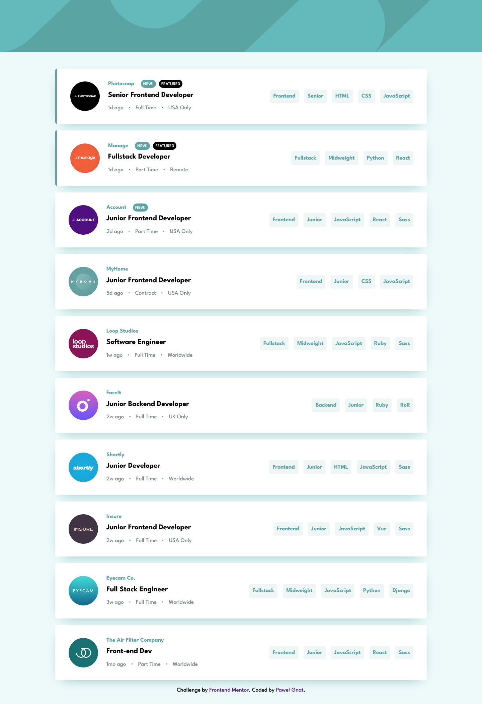

# Frontend Mentor - Job listings with filtering solution

This is a solution to the [Job listings with filtering challenge on Frontend Mentor](https://www.frontendmentor.io/challenges/job-listings-with-filtering-ivstIPCt). Frontend Mentor challenges help you improve your coding skills by building realistic projects.

## Table of contents

- [Overview](#overview)
  - [Screenshot](#screenshot)
  - [Links](#links)
- [My process](#my-process)
  - [Built with](#built-with)
  - [What I learned](#what-i-learned)
- [Author](#author)

## Overview

### Screenshot

### Links

- Live Site URL: [Frontend Mentor Static job listing](https://pawel-gnat.github.io/Frontend-Mentor-Static-job-listings/)

## My process

Firstly I fetched my json data and rendered it. Then I coded filter functions with add and delete tech stack possibility.

### Built with

- Semantic HTML5 markup
- CSS custom properties
- Flexbox
- Mobile-first workflow
- JavaScript

### What I learned

Task completed in 15 hours. I learned how to add functions inside my createElement template (to add multiple elements) and how to destructure elements from an object. I needed few hours to think how to implement filter function, that was a main challenge here. I'm quite happy with my solution.

## Author

- Frontend Mentor - [@Pawel-Gnat](https://www.frontendmentor.io/profile/Pawel-Gnat)
